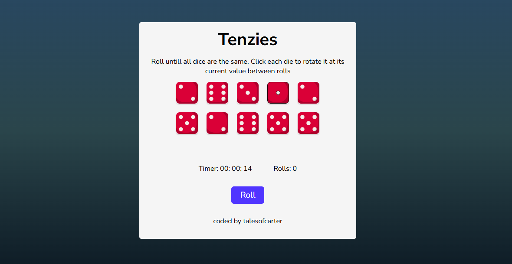
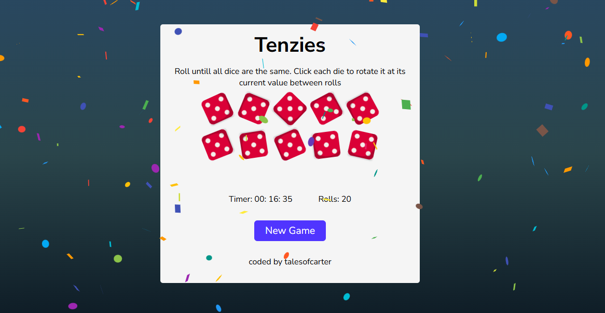

# Tenzies Game

## Table of Contents

- [Introduction](#introduction)
- [Game Setup](#game-setup)
- [Skills Learned](#skills-learned)
- [Features](#features)
- [Screenshots & Video](#screenshots--video)
- [Credits](#credits)

## Introduction

This is my approach to the Capstone Project on Scrimba - Tenzies.

## Game Setup

Tenzies allows users to click a dice to rotate it while keeping its current value. The user then proceeds to roll the other dice. The user wins when all the dice are rotating and have the same value.

## Skills Learned

1. State management
2. Functional components
3. Hooks (`useEffect`)
4. Inline styles
5. Conditional rendering
6. Immutability
7. Props and props drilling

## Features

1. Background image to represent real dice
2. Tracker to monitor the number of rolls
3. Timer

## Screenshots & Video

[Watch Gameplay Video](path/to/video.mp4)

> Replace `path/to/screenshot.png` and `path/to/video.mp4` with the actual paths in your repository.

## Credits

The creator of the dice icons is [rizal2109 - Flaticon](https://www.flaticon.com/authors/rizal2109).

